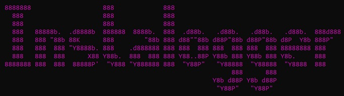
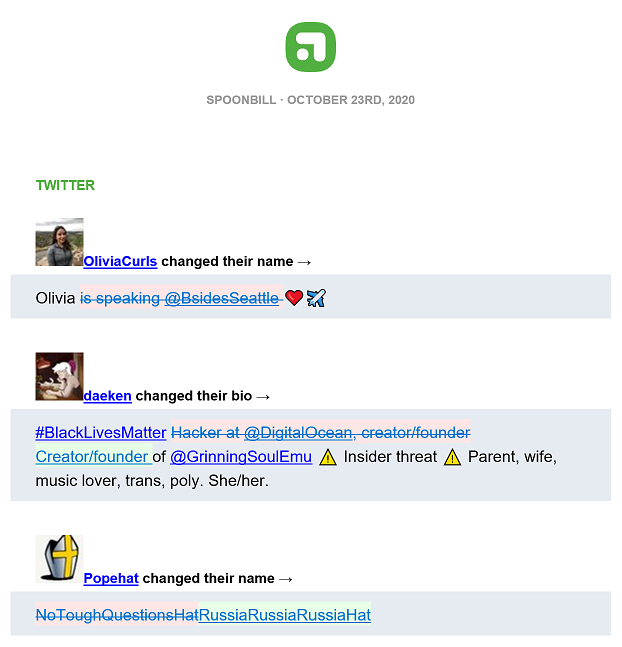
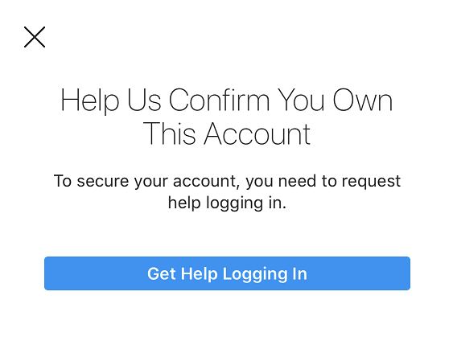

#Instalogger
Keeping up with the... well, whoever you follow on Instagram

##Table of Contents
- [Introduction](#introduction)
- [Program Structure](#programstructure)
- [Database Tables](#databasetables)
- [Build and Installation](#buildandinstallation)

<a name="introduction"></a>

## Introduction
One of my favorite services is [Spoonbill](https://spoonbill.io/), a Twitter app that will email you changelogs (with diffs!) about the changes people make to their Twitter profiles.



I'd really like that kind of service from other social media services, but they don't offer them. Twitter's Terms of Service allows for something like Spoonbill, but other services don't, so we'll have to build it ourselves. My Facebook friends don't change their profiles very often, but my Instagram friends are fairly active with their changes so we'll work with that service. We'll want the following features:

- Automated login for Instagram and query the service for changes to the profiles you Follow
- Ability to use Two Factor Authentication with SMS and TOTP
- Log profile changes to Microsoft SQL Server
- Detect differences in profiles prior to the most recent change
- Resize profile pictures for inclusion in change reports
- Send a daily email showing changes in the profiles you Follow

Ideally every 24 hours I'd get an email that has a report of all the accounts I follow who have changed their profiles. So let's build it.

### Let's talk about Bots
Bot usually implies maliciousness, even though it isn't in our case. There are two types of Bots: scrapers and spammers. This, technically, is a scraper even though isn't trying to harvest the data for misuse. At the beginning, naively, I worked with my actual account because it had authentic activity history, it was already following the accounts I wanted changelogs from, and I wasn't really thinking about it. Originally I had it enumerate changes every hour, but then I kept getting notices of weirdness when in the Instagram app. So I changed it to every few hours, and still got the notices and requests for 2FA confirmation. Finally, my account got soft locked. My friends could see me, people who weren't following me could see me, but there was no way to log into the account. Logging into the web site didn't work, resetting the password didn't work, confirming with 2FA didn't work, they all resulted in this notice:



That button only sends you to a help page. All you can do is send a support request for help and... wait. I waited more than two weeks before my account was reactivated. Most people will wait longer. I don't recommend you use your actual Instagram account with this because it's very likely to get banned.

All that said: with one change detection run per day, randomized delays on everything, and login settings used at the time of the current commit it's been several weeks since I've gotten any notices of unusual account activity. More than one change to a field in the same day isn't going to be detected, and the risk of getting your account banned still exists, but the risk is about as low as you can get it while still getting some fidelity on changes.

<a name="programstructure"></a>

## Program Structure

### Program
The `Program` Module is a simple harness that loads the configuration, connects to the SQL Server, and invokes the primary methods in the `Instagram`, `Database`, and `Report` classes. It has the `Instagram` class load the Followers, feeds each one to the `Database` class to check for differences from the previously stored data, and then has the `Report` class process the differences into an HTML email with embedded attachments to send to the destination address.

Finally, it picks a random amount of time between 18 and 24 hours to wait before loading and processing all of the data again.

### Configuration
Normally I hate writing configuration loading and storage, but in newer versions of .NET Core this has gotten much easier and quicker. In .NET Core 3.1 you define the `Properties` you want to keep track of and then use a `JsonSerializer` to serialize/deserialize to/from text, which you can quickly read or write to a file. In our case we're storing configuration in `config.json`. For this project we keep track of the following `Properties`:

- `DatabaseString`: Stores a Microsoft SQL Server database connection string
- `InstagramUsername`: Username of the account used to access Instagram
- `InstagramPassword`: Password for the Instagram account
- `InstagramTwoFactorAuthCode`: The private Base32 two factor secret data given by Instagram to log into the account, if TOTP is being used. Do not include spaces, only the letters and numbers that represent the secret.
- `TwilioAccountSid`: The Account SID used to check Twilio for SMS 2FA, if SMS 2FA is being used
- `TwilioAuthToken`: The Authentication Token used for the Twilio account, if SMS 2FA is being used
- `TwilioPhoneNumber`: The phone number used to follow the SMS two factor flow with Twilio, if SMS 2FA is being used
- `SmtpMailServer`: The SMTP server used to send reports to the reporting email address
- `SmtpUsername`: The username to use to send mail from the SMTP server, if necessary
- `SmtpPassword`: The password to use to send mail from the SMTP server, if necessary
- `SmtpPort`: The port to use to send mail to the SMTP server, defaults to 25
- `SmtpUseTLS`: Indicates whether TLS is required for the chosen SMTP port, defaults to `False`
- `SmtpFromAddress`: The email address that the completed reports will be sent from
- `SmtpToAddress`: The email address that will receive the completed reports
- `LastReportingTime`: The last time the report was sent to the corresponding SmtpToAddress
- `PreviousSessionJSON`: Any serialized login session data for Instagram

### TwilioHelper
To help secure your Instagram account you can associate a phone number with it and use Two Factor Authentication (2FA). Although TOTP 2FA is free and the codes are easy to generate, I've been looking for a reason to try out Twilio so I acquired a phone number to use with their programatic SMS service.

When the Instagram API SMS 2FA is required a `TwilioHelper` object is constructed using the Account SID, Authentication Token, and Phone Number from the configured Twilio account. It calls `GetMostRecentSMSAsync()` to get the latest SMS message, processes it to get the 6 digit Instagram 2FA code, and then calls `DeleteAllSMSAsync()` to delete all messages in the account to minimize confusion in subsequent executions. Varients to wait indefinitely for messages to arrive before reading or deleting them and getting a count of SMS messages stored in the phone number are provided as well.

### Instagram
Most of the work involved in getting Instagram data revolves around the `LoginAsync()` and `GetFollowersAsync()` methods. Instagram takes a `Configuration` instance with the `InstagramUsername`, `InstagramPassword`, and depending on 2FA settings the `InstagramTwoFactorAuthCode`, `TwilioAccountSid`, `TwilioAuthToken`, and `TwilioPhoneNumber` fields filled in. After successfully using the Username and Password Instagram may indicate that one of those 2FA methods are required. If SMS 2FA is required it uses a `TwilioHelper` instance to handle the 2FA code. If a TOTP 2FA code is required it computes it using the 2FA private key material and the TwoFactorAuth.Net package. There are about a thousand places where login can go wrong or have unexpected results, but the most common login flows have been filled in.

Once a successful login has occurred you can call `GetFollowersAsync()` to fill the data elements in the `CompiledProfile` structure for each user the account is Following.

### Database
The `Database` class takes a Microsoft SQL Server-compliant database connection string as its constructor and opens a `SqlConnection` to the server. Each `Database` instance represents one and only one `SqlConnection` and they shouldn't be shared among threads. You can have one `Database` instance per thread, or multiple instances per thread, but not multiple threads sharing an instance.

`Database` can manipulate `CompiledProfile` data by Instagram username or by the Instagram ID (IGID). The IGID is used throughout because usernames can change but IGIDs are constant throughout the life of the account. It can add or store `CompiledProfile` data, or it can compare `CompiledProfile` data to what's already in the database and store changes.

It can also return a record of changes in each field by IGID along with the date and time the change was detected as a `ChangeRecord` object. This functionality is used by the `Report` class to compile the HTML report email.

### Report
`Report` primarily queries the database for all of the detected changes that have happened since yesterday. It generates an HTML email with embedded images that, for each profile, shows the last known state of the changed (whenever that was) and all of the changes detected in the last day with red lining for removed portions and green highlights for new text. ImageSharp by SixLabors is responsible for the minimal graphics work, DiffPlex for the diffing process, and EASendMail for the email construction and transmittal. Links to those packages can be found in the Package Requirements section and are installed from NuGet when you first build the Solution.


<a name="databasetables"></a>

## Database Tables
The database tables are all very similar to each other. Each one stores a record from a different field in the Instagram profile and all of them have a field for the IGID, the username, and a timestamp for the entry. `ChangeLog` is the only one that doesn't explicitly store a field from the profile, it's just a record that some field in some part of the profile changed and that profile should be queried from the database the next time the change report is run.

- `ChangeLog` - A logs that change somewhere in a profile was made
- `BiographyChanges` - logs the Biography field
- `ExternalURLChanges` - logs the External URL field
- `FullnameChanges` - logs the Full Name field
- `LocationChanges` - logs the Location field, if applicable
- `ProfilePicChanges` - logs the URL to the profile picture and stores a copy of the picture
- `UsernameChanges` - logs changes to the username

<a name="buildandinstallation"></a>

## Build and Installation

### Software Requirements
This project was developed with the following dependencies:

- [Windows 10](https://www.microsoft.com/en-us/software-download/windows10) or [Windows Server 2019](https://www.microsoft.com/en-us/evalcenter/evaluate-windows-server-2019)
- [Visual Studio 2019](https://www.visualstudio.com/vs/professional/) with [.NET Core 3.1](https://dotnet.microsoft.com/download/dotnet-core/3.1) and the [Windows 10 SDK](https://developer.microsoft.com/en-US/windows/downloads/windows-10-sdk)
- [Microsoft SQL Server 2016](https://www.microsoft.com/en-us/sql-server/sql-server-2016)

### Package Requirements
These packages are already included in the Project files and will be downloaded and compiled via NuGet during the Build process.

 - [DiffPlex](https://github.com/mmanela/diffplex/) - A quick and easy way to diff short (or large) amounts of text
 - [EASendMail](https://www.emailarchitect.net/easendmail/) - Easily build HTML email with embedded images
 - [SixLabors.ImageSharp](https://github.com/SixLabors/ImageSharp) - Platform agnostic package to resize images
 - [System.Data.SqlClient](https://github.com/dotnet/corefx) - .NET Framework has an SQL Client built into it, but .NET Core requires this external class
 - [Twilio](https://github.com/twilio/twilio-csharp) - Interact with the Twilio service, which we'll use for SMS 2FA
 - [TwoFactorAuth.Net](https://github.com/RobThree/TwoFactorAuth.Net) - Twilio costs money, so better than SMS 2FA is TOTP 2FA, which in addition to being more secure costs $Free.99
 
### Change the ``config.json`` and ``InitializeDatabase.sql`` Files
The `config.json` file contains the configuration necessary to connect to the SQL Server, Instagram, Twilio, and use TOTP 2FA. The InitializeDatabase.sql needs to be run only when first configuring the database server and requires a modification to store the database files in the right place for your environment.

#### ``config.json``
A sample configuration is provided with the Solution.

```
{
  "DatabaseString": "Data Source=sql.host.com;Initial Catalog=Instalogger;Integrated Security=True",
  "InstagramUsername": "username",
  "InstagramPassword": "hunter2",
  "InstagramTwoFactorAuthCode": "1SSNNTVUEEU21EKEYSZ5PJUVQMHYK1B3",
  "TwilioAccountSid": "DB7e1c18d2ec11d28374dfee203f52099c8",
  "TwilioAuthToken": "384936ba47fdce9eb3dd2938bc1726ac",
  "TwilioPhoneNumber": "1231231234",
  "SmtpMailServer": "mail.host.com",
  "SmtpUsername": "",
  "SmtpPassword": "",
  "SmtpPort": 25,
  "SmtpUseTLS": false,
  "SmtpFromAddress": "from@host.com",
  "SmtpToAddress": "to@host.com",
  "LastReportingTime": "2020-10-22T23:33:18.6763706-04:00",
  "PreviousSessionJSON": ""
}
```

#### ``InitializeDatabase.sql``

This SQL script creates the expected tables in the database server pointed to by the SQL Server connection string. Make sure you connect to the SQL Server with the permissions needed to create and modify a database. When the script completes you will have a database with empty tables ready to be used for data storage and comparison.

- Before you run this script you'll need to change the `CREATE DATABASE` statement in this file to handle where the MDF and LDF files are stored.

### Build and Run

After cloning the repository, clone the [InstagramApiSharp](https://github.com/ramtinak/InstagramApiSharp/) repository into the same directory as the `Instalogger.sln` file. Open the Solution, verify your platform is selected correctly, and click Build. Run the resulting executable. After the first pass you'll get a report sent to the email account in the `SmtpToAddress` configuration parameter.

!(Sample Instagram report)[images/Screenshot3.png]
